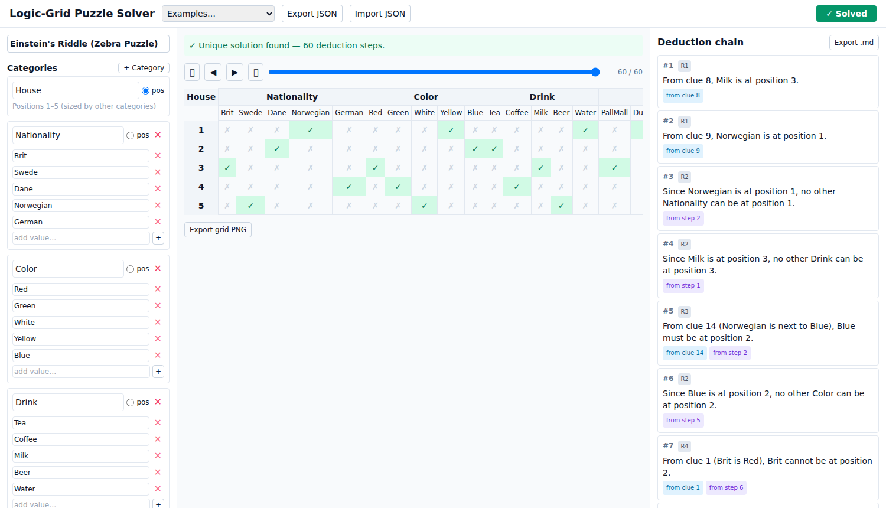

# Logic-Grid Puzzle Solver

A web application that lets you define logic-grid puzzles (a.k.a. Einstein /
zebra puzzles) by declaring entity categories and clues, then **solves the
puzzle and explains the solution as a step-by-step, human-readable deduction
chain** — each step citing the clues and prior deductions that justify it.

The novelty is not solving (that's mechanical) but **generating explanations
that mirror how a human reasons**. A SAT solver finds and verifies the unique
solution; a separate forward-chaining inference engine, guided by the SAT
answer as an oracle, produces the narrative.



## Features

- Define puzzles: 3–6 categories, one mandatory position category, `n ∈ [3,8]`.
- Two clue-entry modes: **structured** templates and **natural language**
  (LLM-parsed, with explicit user confirmation of every parse).
- Exactly the **9 supported clue types** (equality, inequality, at/not-at
  position, immediately/somewhere left/right of, next to).
- Three outcomes detected: **unique**, **under-constrained** (shows two
  solutions + ambiguous cells), **over-constrained** (shows a **minimal
  unsatisfiable subset** of clues with a verbal explanation).
- **Step playback**: scrub the deduction chain forwards/backwards with
  synchronized grid highlighting (mouse, slider, or arrow keys).
- Export: puzzle as JSON, deduction chain as Markdown, grid as PNG.
- 5 built-in examples including Einstein's classic zebra puzzle.
- Fully **offline-capable** — only the optional natural-language path needs a
  network/LLM.

## Architecture

```
src/core/        Pure, UI-free solving core (runs in Node and the browser)
  types.ts            Domain model (puzzles, clues as a discriminated union)
  validation.ts       Well-formedness checks (§5.1)
  clues/              Clue handler registry — composition seam (§5.3/§5.4/§5.6)
  encoder.ts          CNF encoding with canonical ordering (§5.4)
  sat.ts              SatSolver interface + MiniSat (logic-solver) impl (§5.5)
  pipeline.ts         validate → encode → solve → classify (§5.5)
  mus.ts              Deletion-based MUS extraction (§5.8)
  inference/          Knowledge state + rules R1–R6 + explanation (§5.6)
  report.ts           Pure pipeline → serialisable report
src/worker/      Web Worker transport + 10s timeout (§5.5)
src/store/       Zustand app state
src/ui/          React components (three-pane layout, §6)
src/examples/    Canned puzzles (§6.2)
server/          Express LLM proxy + static serving (§5.9, deploy)
tests/           Vitest unit/integration/property + Playwright e2e (§8)
docs/            COMPOSITION_OVER_INHERITANCE.md (presentation notes) + assets
```

The codebase deliberately favours **composition over inheritance** throughout
(clue behaviours as composed handler objects in a registry; inference rules as
strategy objects; the SAT solver behind an injected interface). See
[`docs/COMPOSITION_OVER_INHERITANCE.md`](docs/COMPOSITION_OVER_INHERITANCE.md).

## Tech stack

React + TypeScript + Vite · Tailwind CSS · Zustand · `logic-solver`
(Emscripten-compiled MiniSat) in a Web Worker · Express LLM proxy · Vitest +
Playwright.

## Develop

```bash
npm install
npm run dev          # Vite dev server on http://localhost:5173
npm run server:dev   # (optional) LLM proxy on :8787, for the NL clue path
```

## Test

```bash
npm test             # Vitest unit + integration + property (§8.1/8.2/8.4)
npm run test:coverage
npm run e2e          # Playwright end-to-end (§8.3); needs `npx playwright install chromium`
npm run typecheck
```

## Build & deploy (on this machine)

This app is deployed **on this server** (not Vercel — see
[`ASSUMPTIONS.md`](ASSUMPTIONS.md)). The Express server serves the built static
bundle and hosts the LLM proxy:

```bash
npm run build        # → dist/
npm run start        # serves dist/ + /api on http://localhost:8787
```

To enable the natural-language clue path, set an OpenRouter key before
`npm run start` (the proxy uses OpenRouter for budget reasons — see
[`ASSUMPTIONS.md`](ASSUMPTIONS.md) §A.3):

```bash
export OPENROUTER_API_KEY=sk-or-...                 # optional; app works fully without it
export OPENROUTER_MODEL=anthropic/claude-3.5-sonnet # optional; default is the cheaper claude-3.5-haiku
```

For a long-lived deployment, run `npm run start` under a process manager
(systemd, pm2, or `nohup`), optionally behind nginx on port 80/443.

## Data format

Puzzles import/export as versioned JSON; see §7 of `SPECS.md` and the examples
in `src/examples/`.
